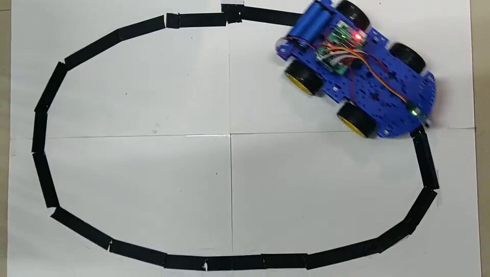

 

## 关于项目

本项目是以Arduino单片机为控制核心，主要研究机器人的循迹功能。利用红外线传感器检测道路上的障碍，然后把数据传送给单片机，当红外线传感器检测到距离小车前方有障碍物时单片机就发出指令让小车停止继续前进，然后蜂鸣器发出声音警告。如果前方没有障碍物就沿着黑线行走。除此之外，小车还可以用蓝牙控制行动。
本系统在硬件方面，以Arduino单片机为控制核心，以红外线传感器实现循迹和避障，也能也切换到蓝牙模式控制小车行动。在软件方面，利用Arduino语言进行编程，通过Arduino编程来控制小车运转。该系统在驱动方面采用L293D双桥驱动电机驱动4个直流电机实现小车运行。并且，用PWM系统调速,控制小车前进的速度。本设计具有有一定的实用价值。

## 运行效果

 

